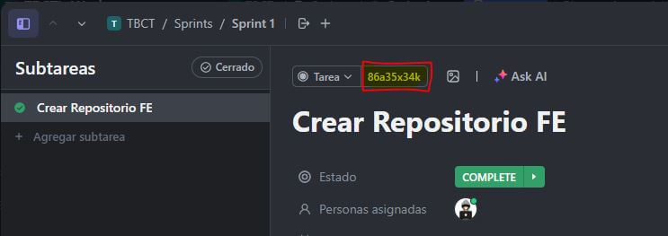

# Git

## ✍ Commits

Para los commits del proyecto seguiremos el patrón de [Conventional Commits](https://www.conventionalcommits.org/en/v1.0.0/)  

Los prefijos de commits que usaremos son:

1. `feat` --> para cualquier funcionalidad nueva  
2. `fix` --> para arreglar bugs  
3. `docs` --> para agregar documentación  
4. `style` --> para modificaciones de estilos  
5. `test` --> para cuestiones relacionadas a testing  
6. `chore` --> para tareas necesarias pero que no están directamente relacionadas con el código de la app. Por ejemplo: actualización de dependecias, cambio de yarn a npm, etc. 
7. `wip` --> para trabajos en proceso 

Por ejemplo:  

```bash 
git commit -m "chore: replace yarn with npm"
```

## 🌿 Ramas

Todos los repos del proyecto tienen 2 ramas principales y fijas:

- main
- dev

Todas las ramas auxiliares saldrán de la rama dev y tendrán como nombre el `ID` que nos da ClickUp para cada tarea del sprint.



## 🧵 Pull requests

El título de cada PR deberá tener un nombre descriptivo + el `ID` que la tarea tiene en ClickUp. Por ejemplo:

```
Agrego componente Button en UI (#86a35690b)
```

Agregar en la descripción de la PR un link a la task de ClickUp para mayor organización.

Una vez realizada la PR, compartirla en el canal de Discord `PRs` con el siguiente formato:

```
FE: Implementar storybook:
https://app.clickup.com/t/86a368rdp
https://github.com/TheBigCodeTheory/frontend/pull/1
```

Cuando tengamos un template de PRs lo agregamos por acá.
